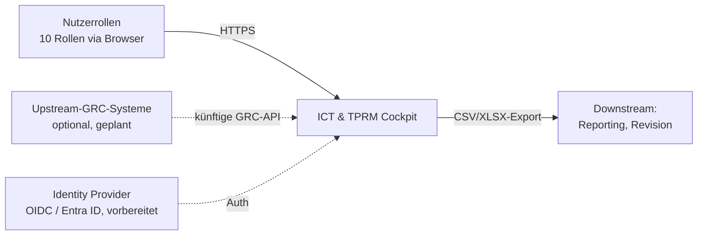
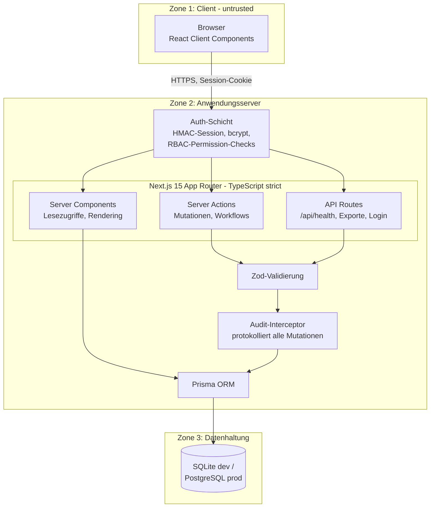
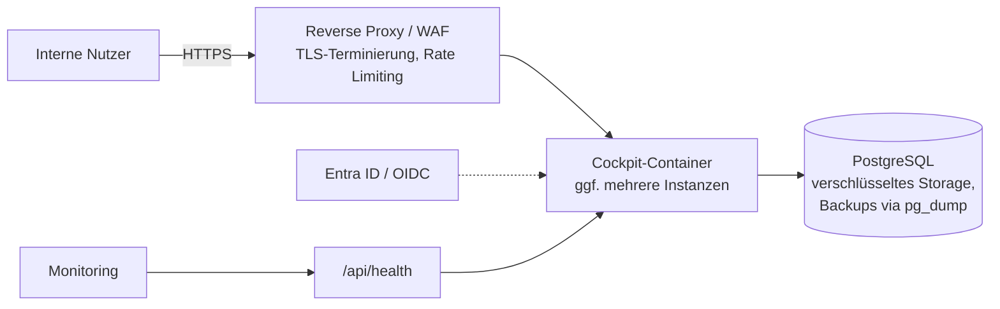

# Architekturdokumentation

**Dokument:** Architektur – Systemkontext, Komponenten, Datenflüsse, Deployment
**Anwendung:** ICT & Third Party Risk Management Cockpit
**Status:** Freigegeben | **Version:** 1.0 | **Stand:** 2026-08

---

## 1. Systemkontext

Das Cockpit ist eine Webanwendung zur Dokumentation und Steuerung von ICT- und Drittparteirisiken eines regulierten Finanzinstituts (DORA-Kontext). Es wird von zehn Nutzerrollen bedient (Administrator, ICT Risk Manager, Third Party Risk Manager, Information Security Officer, Risk Owner, Control Owner, Action Owner, Reviewer/Second Line, Management, Auditor; Details: `docs/governance/raci.md`).

- **Nutzer:** ausschließlich interne Mitarbeitende; Zugriff über den Browser, in Unternehmensumgebungen aus dem internen Netz bzw. via VPN.
- **Upstream-GRC-Systeme:** optionaler Integrationspunkt (z. B. konzernweites GRC); derzeit kein Live-Interface, Austausch über Exporte, API vorgesehen (Abschnitt 6).
- **Downstream:** Berichte und Exporte (CSV/XLSX) für Management-Reporting, Interne Revision, Aufsichtskommunikation.

## 2. Komponentenarchitektur

**Komponenten:**
- **Server Components:** rendern rollenspezifische Sichten serverseitig; Datenzugriff nur nach Permission-Prüfung; es gelangen keine Secrets oder unberechtigten Daten ins Client-Bundle.
- **Server Actions:** kapseln alle Mutationen (Statusübergänge, Freigaben, Stammdatenpflege) inkl. Workflow-Regeln (z. B. Ersteller ≠ Reviewer).
- **API Routes:** technische Endpunkte (Healthcheck `/api/health`, Login, CSV/XLSX-Export).
- **Auth-Schicht:** validiert das HMAC-signierte Session-Cookie je Request, lädt Benutzer/Rolle/Permissions, setzt RBAC serverseitig durch (deny by default, Ownership-Checks gegen IDOR).
- **Zod-Validierung:** Schema-Validierung aller Eingaben vor jeder Verarbeitung.
- **Audit-Interceptor:** zentraler Schreibpfad-Hook; erzeugt für jede Mutation einen AuditLog-Eintrag (Benutzer, Zeitstempel, Objekt, Alt-/Neuwert). Der AuditLog ist append-only – es existiert kein Änderungs- oder Löschpfad in der Anwendung.
- **Prisma ORM:** typsicherer, parametrisierter DB-Zugriff; Schema-Verwaltung über Migrationen.

## 3. Datenflüsse

| # | Fluss | Beschreibung |
|---|---|---|
| 1 | Login | Browser → API Route → bcrypt-Verifikation → HMAC-signiertes Session-Cookie (HttpOnly, Secure, SameSite) → AuditLog-Eintrag |
| 2 | Lesen | Browser → Server Component → Auth/RBAC-Prüfung → Prisma → DB → gerendertes HTML (nur berechtigte Daten) |
| 3 | Mutation | Browser → Server Action → Session-/Permission-Prüfung → Zod-Validierung → Workflow-Regeln (SoD) → Prisma-Write + Audit-Interceptor → Notification bei Bedarf |
| 4 | Freigabe | Wie 3, zusätzlich Approval-Datensatz; systemseitige Prüfung Antragsteller ≠ Genehmiger |
| 5 | Export | Browser → API Route → RBAC-Prüfung → Aggregation → CSV/XLSX-Stream; Export wird auditiert |
| 6 | Healthcheck | Monitoring → `/api/health` → App- und DB-Status (ohne Authentifizierung, ohne fachliche Daten) |

## 4. Sicherheitszonen

| Zone | Inhalt | Vertrauensniveau | Kontrollen |
|---|---|---|---|
| 1 – Client | Browser | untrusted | CSP/Security-Header, React-Escaping, keine Secrets im Bundle |
| 2 – Anwendung | Next.js-Prozess | trusted | Auth-Schicht, RBAC, Zod, Audit-Interceptor, Rate Limiting (Login) |
| 3 – Daten | Datenbank | stark geschützt | Netzsegmentierung, Least-Privilege-DB-User, Verschlüsselung at rest (prod) |
| 4 – Admin | Administrationsfunktionen | separat kontrolliert | Admin-Grenze mit vollständiger Auditierung, SoD-Regeln |

Die Grenzen zwischen den Zonen entsprechen den Trust Boundaries TB1–TB4 des Bedrohungsmodells (`docs/security/threat-model.md`).

## 5. Datenmodell (Überblick)

Zentrale Entitätsgruppen (vollständige Definition im Prisma-Schema):
- **Organisation & Kontext:** User, Role, Permission, OrganizationalUnit, Location, BusinessProcess, CriticalFunction, Asset, IctService
- **Risiko:** Risk, RiskAssessment, RiskCategory, RiskAcceptance
- **Kontrollen & Maßnahmen:** Control, ControlAssessment, Action
- **Drittparteien:** ThirdParty, ThirdPartyService, Subcontractor, Contract, ExitStrategy
- **Compliance & Nachweise:** Evidence, RegulatoryRequirement, ComplianceMapping
- **Betrieb & Reaktion:** Runbook, RunbookStep, RunbookExecution, RunbookStepResult, Playbook, PlaybookExecution
- **Querschnitt:** Approval, Comment, Notification, Report, AuditLog, AppSetting

## 6. Integrationspunkte

| Integration | Status | Beschreibung |
|---|---|---|
| **OIDC / Entra ID** | vorbereitet | Die Auth-Schicht ist so gekapselt, dass der lokale Credential-Login durch einen OIDC-Flow (inkl. MFA/Conditional Access des IdP) ersetzt werden kann; Rollenzuordnung dann über IdP-Gruppen-Mapping. Für Unternehmensbetrieb empfohlen. |
| **CSV/XLSX-Export** | verfügbar | Berichte und Listen (Risiken, Maßnahmen, Drittparteien, Compliance-Status) als Datei-Export; berechtigungsgeprüft und auditiert. |
| **GRC-API** | geplant | Versionierte REST-API für den Austausch mit Upstream-GRC-Systemen (Risiko- und Drittparteidaten); Authentisierung über Service-Credentials/OAuth2, Read-first-Ansatz. |
| **Monitoring** | verfügbar | `/api/health` für Verfügbarkeitsüberwachung. |

## 7. Deployment-Sichten

### 7.1 Lokal (Entwicklung/Demo)
- `npm run dev`, SQLite-Datei als Datenbank, Seed mit Demo-Benutzern.
- Nur für Entwicklung und Demonstration; keine at-rest-Verschlüsselung, Demo-Zugangsdaten aktiv (Restrisiken siehe Threat Model).

### 7.2 Docker Compose
- Zwei Services: `app` (Next.js-Image, gebaut aus Release-Tag) und `db` (PostgreSQL mit persistentem Volume).
- Konfiguration über Env-Variablen (`DATABASE_URL`, `SESSION_SECRET`); Migrationen via `prisma migrate deploy` beim Start bzw. als Init-Schritt.
- Geeignet für Test-/Abnahmeumgebungen.

### 7.3 Unternehmensumgebung (Produktion)

- Reverse Proxy übernimmt TLS, zusätzliche Security-Header und instanzübergreifendes Rate Limiting.
- Datenbank in separatem Netzsegment; Zugriff nur vom Anwendungs-Service.
- Betrieb, Backup/Restore und Release-Prozess: siehe `docs/operations/README.md`.

## 8. Architekturentscheidungen (Auszug)

| Entscheidung | Begründung |
|---|---|
| Server-zentrierte Architektur (Server Components/Actions) | Sicherheitskontrollen (RBAC, Validierung, Audit) an einem Ort serverseitig; minimale Client-Logik |
| Prisma mit SQLite/PostgreSQL | Identisches Schema für Demo und Produktion; einfacher lokaler Einstieg, produktionsfähige DB |
| Eigener Audit-Interceptor statt DB-Trigger | Fachlicher Kontext (Benutzer, Aktion) nur in der Anwendungsschicht vollständig verfügbar; DB-seitige Härtung ergänzend möglich |
| HMAC-Session statt Server-Session-Store | Zustandslose Skalierung; Widerruf über kurze Laufzeiten und Benutzer-Deaktivierung |

---
*Die Anwendung unterstützt die Dokumentation und Steuerung regulatorischer Anforderungen. Sie ersetzt keine rechtliche, aufsichtsrechtliche oder unabhängige Compliance-Prüfung.*
